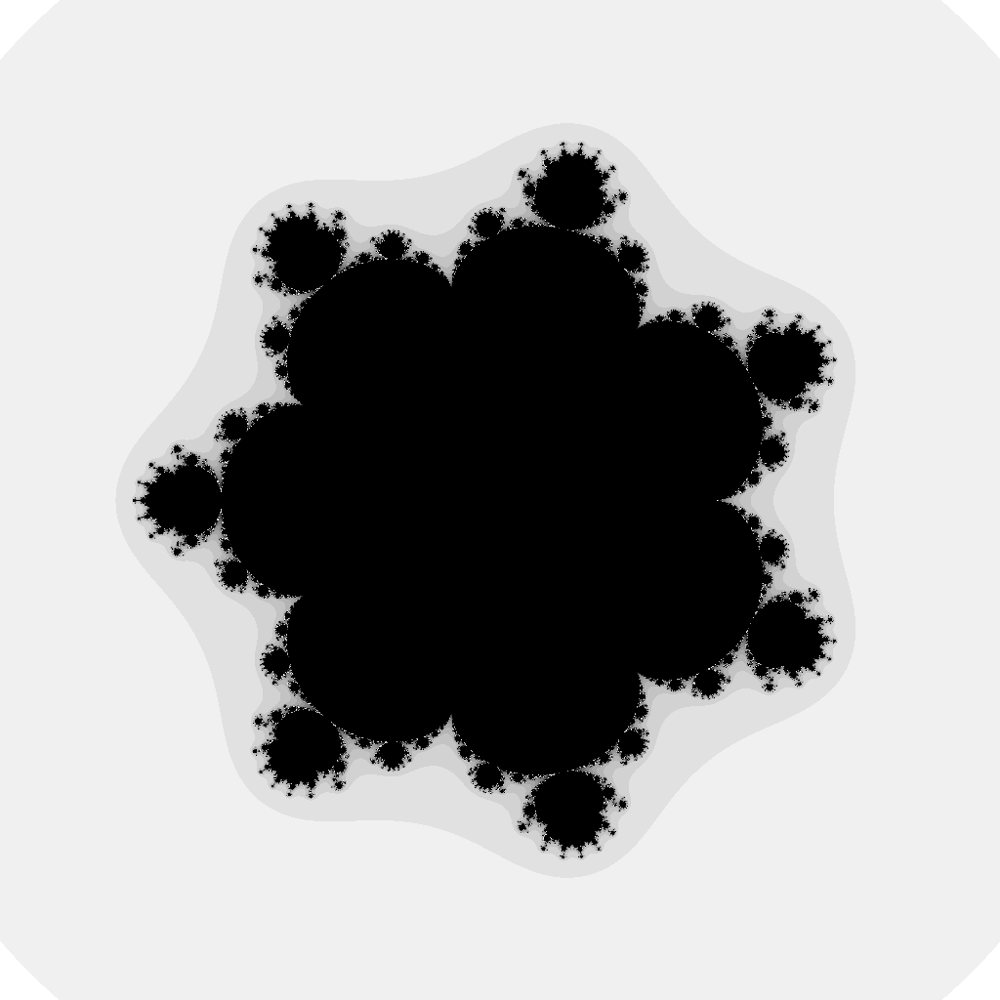
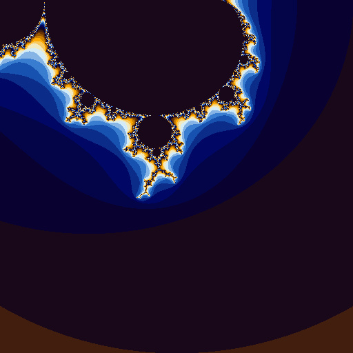

# Fractal Engine

This is a simple Golang library for rendering 2D still images or animations of
fractals, visualized in the complex plane.
Here are some examples:

  
  

There is a simple command line program in the `cmd` directory which can be built
(using the `make`) command to a binary called `fractal-engine`.
This program offers many command line flags to render PNG images/GIF animations,
while varying the image and plot dimensions, function whose Julia set is being
plotted, iteration count of the function, number of animation frames, color
palettes and much more.
Users may see example usage of this library through the source of the driver
code in `cmd`.

The image and animation renderers have been designed concurrently so as to
optimize the render process.
Some optimizations have also been made to improve heap usage by preventing
reallocations of frequently used objects in the render process.
These should deliver better performance to the user.
